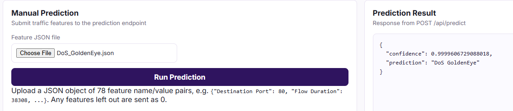

# Intrusion Detection System (IDS)

Machine Learning based Intrusion Detection System built using the CICIDS2017 dataset.

## Overview

This project reads the uploaded json file of a flow and predicts if its normal or any suspicious attack.

Current attack classes:

- BENIGN
- DoS Hulk
- DoS GoldenEye
- DoS Slowloris
- DoS Slowhttptest
- Heartbleed

## Features

- Data cleaning and preprocessing
- Label encoding
- Feature scaling
- Random Forest classification
- Feature importance analysis
- Model serialization using Joblib
- Flask deployment
- WOrking Dashboard

## Dataset

Dataset: CICIDS2017

Current training file:

- Whole CICIDS2017 dataset

## Project Structure

```text
IDS/
├── preprocessing.py
├── train.py
├── visualize.py
├── scaler.pkl
├── label_encoder.pkl
├── feature_names.json
├── model.pkl
└── archive/
```
## Dashboard


## Prediction example


## Feature Importance


## Results

Accuracy: 99.93%

Classification Metrics:

- Precision: ~1.00
- Recall: ~1.00
- F1 Score: ~1.00

### Feature Importance

Top contributing features include:

- Max Packet Length
- Bwd Packet Length Max
- Total Length of Bwd Packets
- Flow IAT Mean


## Installation

```bash
pip install pandas numpy scikit-learn matplotlib joblib
```

## Usage

### Preprocess Data

```bash
python preprocessing.py
```

### Train Model

```bash
python train.py
```

### Generate Visualizations

```bash
python visualize.py
```

## Future Improvements

- Real-time traffic classification
- Compare Random Forest with XGBoost and other models

## Author

Shikhar Gautam
